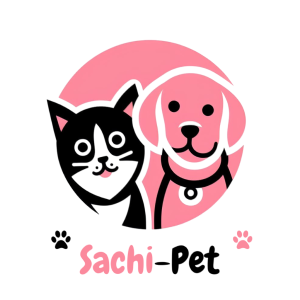
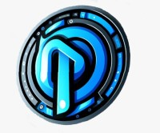

# Sachi Pet-Shop

## By azzai S.A.S

### Proyecto de ecommerce para la petstore de la marca Sachi, especializada en venta de productos para mascotas.Este producto es realizado por nuestra empresa de desarrollo de soluciones web Azza-i S.A.S.

Creado haciendo uso de tecnologias web como html, css con el framework **Tailwind**, y **Angular** como framework frontend en su version 17.3. Para la parte del backend y la creacion de la API se utilizará **Laravel** en su version 11. Para la base de datos se utilizará MySql.

Proyecto  para la clase de ingenieria de software 2 de la CUN.

 ## Integrantes
 - Diana Catalina Beltran - scrum master - diseñadora web
 - Jose Daniel Rojas - desarrollador full-stack

## Enlaces de la carpeta drive con logo y evidencia Dailys

[Enlace Drive](https://drive.google.com/drive/u/3/folders/1utS9NulOrHH5Fb8ibsaXXZ_WmmOgvNvm)

## Enlace Tableros Trello

- [Enlace Tablero - Sprint 1](https://trello.com/b/Uk34wjC4/sprint-1)
- [Enlace Tablero - Sprint 2](https://trello.com/b/fa2bAvwd/sprint-2)
- [Enlace Tablero - Sprint 3](https://trello.com/b/XerCiBqo/sprint-3)

## Enlace Repositorio Backend realizado en Laravel

[Enlace Repo Backend](https://github.com/DanielRojasDV/api-sachi-pet.git)

## Probar Proyecto

1. Clonar Repositorio
2. Instalar librerias con `npm install`
3. Levantar servidor Angular con `ng serve`

**Nota:** ***El proyecto se creo con la ultima version de angular 17.3. Por lo que se necesita el cli actualizado a esta versión para compilar.***
